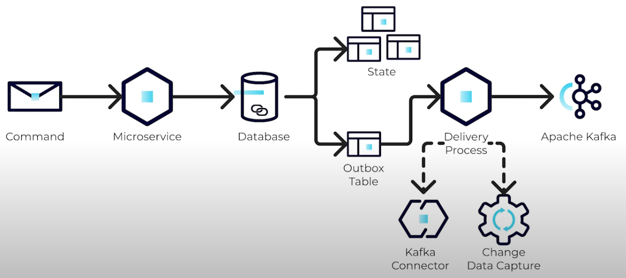

https://developer.confluent.io/courses/microservices/the-transactional-outbox-pattern/

* requirements
  * BBDD / 👀supports transactional updates 👀

* approach
  * ⭐️database transactions⭐️
    * ensure atomic writes BETWEEN 2 tables 
    * == ❌| SAME time, NOT update BBDD & Kafka ❌

* | SAME transaction, update microservice's
  * state
    * ❌if state update fails -> NOT written | outbox ❌
  * outbox table /
    * events | outbox will -- be sent to an -- EXTERNAL messaging platform (_Example:_ Apache Kafka)
      * ways to send
        * MANUALLY
        * tools / monitor outbox table
          * CHOSEN one -- depends on -- DDBB, type 
          * _Example:_ Change Data Capture (CDC), Kafka connectors 
      * 👀if the event successfully delivered to Kafka -> remove | outbox table 👀
        * if the DDBB handle poor performance the removal -> mark records
      * ⚠️guarantee at-least-once⚠️
        * == if deliver to kafka fails (timeout, error, ...) -> retries -> MULTIPLE messages could reach Kafka
    

* Delivery process
  * := process / forward events | outbox table -- to -> Kafka
    * COMMONLY,process == original microservice's ANOTHER thread

* at-least-once
  * | distributed systems, BEST practices
  * -> ⚠️downstream systems need to handle DUPLICATES ⚠️

* uses
  * overcome the dual-write problem 
    * == write data | 2 separate systems (_Example:_ database and Apache Kafka)
