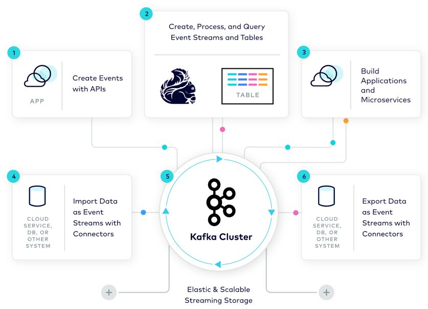
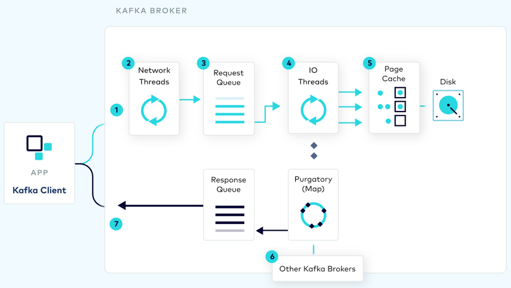
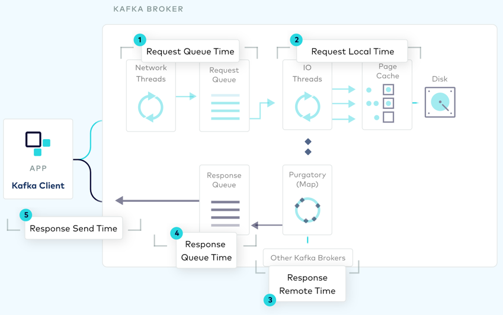

https://developer.confluent.io/

## Overview

* Event Streaming
  * can be
    * created,
    * imported,
    * shared
    * stored
    * replayed
    * reprocessed
  * _Example of events:_ payments, orders, database changes
* Continuous Real-time Processing
  * == | 24x7 / real-time, about streams & tables of data
    * process,
    * join,
    * analyze
  * enables you, 
    * build applications /
      * respond IMMEDIATELY to events
      * | live operations, scale 
* Your Data, Everywhere
  * | 1! platform
  * enables you,
    * 👀connect systems, data centers, and clouds—all👀
* create -- , via APIs, -- events
  * -- through --
    * programmatically (Java, Go, Python, .NET, REST)
    * CLIs 
* | Event Streams, create, process, and Query 
  * recommendations
    * use Flink
      * Reason: 🧠Kafka <- is integrated nicely with -- Flink 🧠 
* Build Applications and Microservices
  * -- via -- native APIs
    * [Kafka Streams library](platform.current.streams.overview.md)
    * [Confluent’s Parallel Consumer](https://github.com/confluentinc/parallel-consumer)
* Import Data -- , with Connectors, as -- Event Streams
  * | your EXISTING cloud services & systems, data are 
    * extracted CONTINUOUSLY
    * imported -- , via connectors & change data capture (CDC), as -- streams | Kafka
      * -> 👀data at rest -- is converted into -> data in motion 👀
* Kafka Cluster
  * Kafka 
    * == 👀event streaming platform's backbone👀  
    * -- provide -- your applications / strong guarantees & transactions
      * Reason: 🧠’s storage layer + its associated protocols -- are -- HIGHLY performant & HIGHLY reliable 🧠
        * uses
          * reading/writing event streams,
          * distributed consumer groups,
          * data replication
    * scales -- with -- your business /
      * use cases == [small use cases, large-scale deployments]
* Export Data -- , with Connectors, as -- Event Streams
  * == feed its event streams | ANY services, systems (data centers, clouds, ...), and geo-locations 
    * uses
      * replicate data | OTHER Kafka environments

## Build Streaming Data Pipelines

* enables
  * Data At Rest -- to -- Data in Motion
* EXISTING cloud services1 & systems1 <- can be connected, via Kafka, -> EXISTING cloud services2 & systems2
  * -- via --
    * importing,
    * exporting,
    * processing data -- as -- continuous streams

## Event Streaming Patterns

* [here](patterns.md)

## Kafka Internals

* see [course](courses.architecture.get-started.md)

### how to configure Kafka Broker?

* PREVIOUS diagram's goal
  * 👀Kafka's data plane's key settings 👀
* Kafka administrators 
  * can -- , by configuring settings, -- optimize Kafka cluster's performance

* `1` == Inbound Socket Buffer
  * `socket.receive.buffer.bytes`
    * == config param
    * by default, `102400`
    * == receive buffer (`SO_RCVBUF`)'s size / allocated
      * -- by the -- OS kernel
      * -- for the -- inbound network socket
    * if = `-1` -> use OS' default 
    * 👀| buffer gets full (-- via -- incoming traffic),
      * sender will be -- ,via TCP’s window adjustment mechanism, told to --  slow down 👀 
        * Reason: 🧠amortize the cost of high network latency🧠
          * _Example:_ if producer | data center != receiver | data center -> -- to -- achieve good throughput
        * _Example:_ if round trip time = 100ms & you want to achieve 10MB/s -> set `SBS * 1 sec / 100ms > 10MB` == `SBS > 1MB`
* `2` == Network Threads
  * `num.network.threads`
    * == config parameters
    * == # of threads /
      * server -- uses to --
        * receive requests -- from the -- network
        * send responses | network 
    * by default, `3`
    * if it's increased -> provide performance improvements 
      * if SSL is enabled -> network threads -- will perform, with HIGH CPU's amount, -- encryption
        * use cases
          * high-throughput use cases
          * clusters / run | JVM's old versions 
      * if SSL is disabled -> data transfers -- will be performed, via -- zero-copy | network threads
        * == disk buffer's message payloads are -- DIRECTLY moved to the -- network buffer
          * if data NOT found | page cache -> network thread 
            * fetch disk
            * WAITS fetching / complete 
  * `socket.request.max.bytes`
    * by default, `104857600`
    * == MAXIMUM number of bytes | socket request 
    * if the inbound socket buffer has been enlarged & rarely in practice -> should OFTEN be increased
* `3` == Request Queue
  * `queued.max.requests`
    * == config parameters
    * by default, `500`
  * `queued.max.request.bytes`
    * by default, `-1`
    * TODO: The size of the Request Queue can be bounded either by the number of requests in the queue (`queued.max.requests`) or the total number of bytes in the queue (`queued.max.request.bytes`)
    * If configured based on the number of requests, the queue will block when full. 
    * If the queue is configured based on the number of bytes, it prevents new requests from being added to the queue based on its total size. 
    * The queue filling in either case will cause the Network Threads to block. 
    * The request queue is the primary means for controlling buffering on the broker while ensuring that out of memory errors are avoided. 
    * A useful heuristic is to configure `queued.max.requests` to equal the number of active clients.
    * This heuristic works as, to ensure strict ordering, the broker only processes one request at a time from a single client.
    * Hence one entry in the request queue per client is typically enough.
* `4` == I/O Threads
  * `num.io.threads`
    * Config parameter
    * default, `8`
    * The number of threads that the server uses for processing requests, which may include disk I/O. 
    * Typically this value is only increased if the broker is configured to write to disk synchronously (see Page Cache section) or at least frequently or if the broker is becoming CPU bound.
* `5` == Page Cache
  * `log.flush.interval.messages`
    * Config parameters
    * default, `Long.MAX_VALUE`
  * `log.flush.interval.ms`
    * default, `null`
  * These two settings control how frequently the disk buffer is flushed. 
  * By default, Kafka is configured for asynchronous writes. 
  * For synchronous writes, set `log.flush.interval.messages=1` and increase the number of IO threads appropriately. 
  * Be aware that synchronous writes are not required in Kafka for durability. 
  * That's because Kafka guarantees that a committed message will not be lost, as long as there is at least one in-sync replica alive, at all times
* `6` == Intra-Cluster Replication
  * `num.replica.fetchers`
    * Config parameters
    * default, `1`
  * `replica.fetch.min.bytes`
    * default, `1`
  * `replica.fetch.wait.max.ms`
    * default, `500`
  * Intra-cluster data replication involves the copying of data from one broker to another as part of each send request. 
  * In cases where replication is enabled (replication factor > 1), data will be staged in the Purgatory holding area until the replication process completes. 
  * On completion, a response is sent back to the producing client, confirming that the sent data is safe.
  * The num.replica.fetchers defines the number of fetcher threads used to replicate messages from a source broker to a destination broker. Increasing this value can increase the degree of IO parallelism in the destination broker.
  * Note that a default of 1 will result in 1 thread per source broker 
  * So if a broker contains follower replicas, with corresponding leaders on 20 different machines there will be 20 threads in total performing replication.
  * Increasing `num.replica.fetchers` to 2 would increase this to 40 threads on this broker
  * The minimum bytes expected for each fetch response are configured using replica.fetch.min.bytes
  * If not enough bytes are available, the fetcher will wait up to `replica.fetch.wait.max.ms` before returning any bytes accumulated during that period
* `7` == Outbound Socket Buffer
  * `socket.send.buffer.bytes`
    * Config parameter
    * default, `102400`
    * The size of the response buffer (`SO_SNDBUF`) allocated by the kernel for the outbound network socket
    * It is relatively unusual to change this parameter
    * If the value is -1, the OS default is used
    * Note that, unlike the request queue, the response queue is not configurable.

### how to monitor performance?

* Performance of the Kafka broker’s internals can be monitored using the JMX metrics the broker exposes.
* Understanding how these metrics reflect time spent in different sections of the broker's data plane is essential for triaging performance issues on the broker
* Click on each section to find detailed information on what metrics are recorded and the implications the different values of these metrics may have on the broker's performance.
* The metric Request Total Time ("kafka.network":name="{Produce|Fetch-Consumer|Fetch-Follower}-TotalTimeMs",type="RequestMetrics") is important as it measures the summation of all these metrics as a single histogram, with decaying weights for older requests.
* Two other important metrics are (1) the average fraction of time the network processors are idle and (2) the average fraction of time the request handler threads are idle
* These are represented as kafka.network:type=SocketServer,name=NetworkProcessorAvgIdlePercent and kafka.server:type=KafkaRequestHandlerPool,name=RequestHandlerAvgIdlePercent, respectively.

* `1` == Request Queue Time
  * The time that a request spends in the request queue
  * Each metric is a histogram and has attributes such as 50%, 99%, 99.9%, and so on
  * A metric will increase if there is backpressure from further down the data plane, for example if IO threads are fully utilized, or there is a delay in replication
  * Request Queue Time contributes to the Request Total Time metric
  * JMX Metric Path: "kafka.network":name="{Produce|Fetch-Consumer|Fetch-Follower}-QueueTimeMs",type="RequestMetrics"
* `2` == Request Local Time
  * The Local Time represents the time spent processing a request
  * Depending on the request type a number of different operations could be performed
  * Notably, for Produce Requests, this metric includes the time taken to save batches of messages to disk (and potentially flush if synchronous persistence is configured, i.e., log.flush.interval.messages=1)
  * For Fetch Requests, the local time includes determining what filesystem offsets need to be transmitted. Although the physical data transfer will be performed by the network threads, and hence falls under the Response Send Time metric below, the network threads do consult Kafka’s index and data files
  * Thus, if delays are observed in the Response Local Time, but not in subsequent sections of the data plane, a potential cause are issues with Disk IO or the configuration thereof
  * Request Local Time contributes to the Request Total Time metric. JMX Metric Path: "kafka.network":name="{Produce|Fetch-Consumer|Fetch-Follower}-LocalTimeMs",type="RequestMetrics"
* `3` == Response Remote Time
  * The Remote Time [1] represents the time a Send Request from a producer spends replicating to other machines
  * This is also known as the time spent in Purgatory: a specific data structure based on a hierarchical timing wheel that holds onto requests as they are replicated
  * The size of the purgatory data structure can also be monitored using a JMX metric [2]
  * Response Remote Time contributes to the Request Total Time metric
  * Generally, Remote Time reflects the time spent replicating between brokers
  * However it should be noted that an increase in Fetch Remote Time may not be an issue since the time spent waiting for new data will also contribute to this metric’s value
  * However if longer pauses are observed the following other metrics are useful for triaging the cause
    * Fetcher Lag [3] indicates the Lag in messages per follower replica
    * Max Lag [4] represents the maximum lag in messages between the follower and leader replicas
      * The metric value is a gauge
      * So it reflects the max of the current lag in each follower replica on this broker
      * Under Replicated Partitions [5] represents the number of under replicated partitions cluster wide
      * Under replicated partitions are those where |ISR| < |all replicas|
      * ISR Shrinkage Rate [6] represents the fluctuation of the ISR which is a common cause of replication delays
      * If a broker becomes unreachable or requests are significantly delayed, the ISR for some of the partitions will shrink
      * When that broker returns, the ISR will expand again once the replicas are fully caught up
      * JMX Metric Paths
        * [1] "kafka.network":name="{Produce|Fetch-Consumer|Fetch-Follower}-RemoteTimeMs",type="RequestMetrics"
        * [2] "kafka.server":name="PurgatorySize",type="FetchRequestPurgatory"
        * [3] "kafka.server":name="([-.\w]+)-ConsumerLag",type="FetcherLagMetrics"
        * [4] "kafka.server":name="([-.\w]+)-MaxLag",type="ReplicaFetcherManager"
        * [5] "kafka.server":name="UnderReplicatedPartitions",type="ReplicaManager"
        * [6] "kafka.server":name="ISRShrinksPerSec",type="ReplicaManager"
* `4` == Response Queue Time
  * The Response Queue Time metric represents the time spent on the response queue
  * Of all these metrics it is often considered the least important as it tends to correlate closely with Response Send Time and the response queue is unbounded and not configurable
  * Response Queue Time does not contribute to the Request Total Time metric (unlike the other four metrics discussed in this diagram)
  * JMX Metric Path
    * "kafka.network”:type=”RequestMetrics”,name=”ResponseQueueTimeMs,request={Produce|FetchConsumer|FetchFollower}"
* `5` == Response Send Time
  * The Response Send Time measures the time spent sending requests back to the network
  * For fetch requests that do not enable SSL this time will include the zero copy transfer from disk to network buffers
  * Response Send Time contributes to the Request Total Time metric
  * JMX Metric Path
    * "kafka.network":name="{Produce|Fetch-Consumer|Fetch-Follower}-ResponseSendTimeMs",type="RequestMetrics"