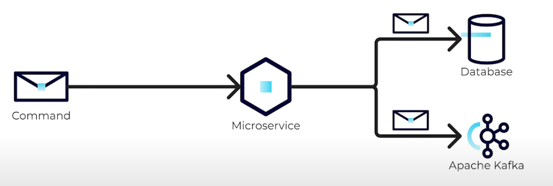
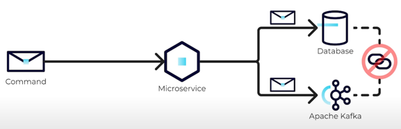

https://developer.confluent.io/courses/microservices/the-dual-write-problem/

* TODO:

* goal
  * update 2 systems / NOT linked 

* ❌2 systems NOT linked -> NOT possible to update -- via -- transactional fashion ❌
  
