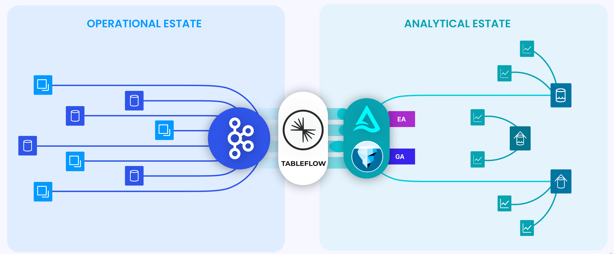
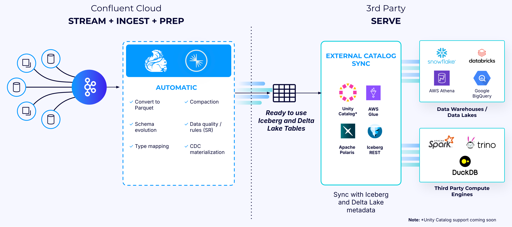

https://docs.confluent.io/cloud/current/topics/tableflow/overview.html

* enables you to,
  * 💡Apache Kafka® topics & associated schemas -- can be represented as -- open table formats💡 / 
    * _Example:_ Apache Iceberg™ or Delta Lake
    * uses
      * feed data warehouse, data lake, or analytics engine / NO complexities of
        * data pre-processing,
          * TYPICALLY, -- through -- custom data pipelines
        * preparation,
        * transfer
  
    * can be exposed as read-only / WITHOUT requiring data duplication 
* automates key tasks
  * _Example:_ 
    * schematization,
    * type conversions,
    * schema evolution,
    * Change Data Capture (CDC) stream materialization,
    * table metadata publishing | catalogs,
    * table maintenance
* integrate with
  * catalogs
  * compute engines
## \+ Confluent Cloud's Apache Flink 

* enables you
  * | BEFORE materializing data into Iceberg or Delta Lake tables,
    * perform real-time stream processing 
      * == data processing -- closer to the -- source
      * == “shift-left” approach
      * == | ingest data, data is
        * enriched,
        * transformed,
        * analytics-ready

# Key features
* TODO: